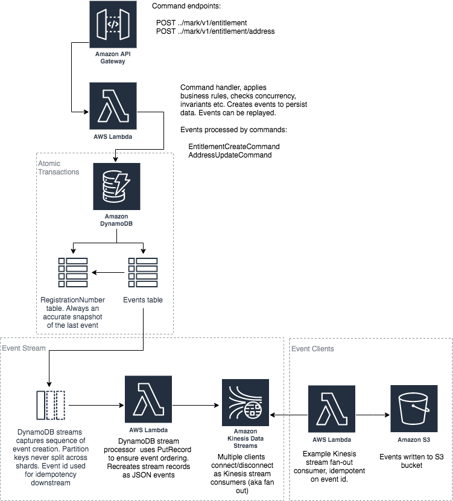

# mark-api



This application depicted above is intended as a strawman to demonstrate the benefits of a light-weight, purely serverless event sourcing system. Event sourcing stores every state change to the application as an event object. These event objects are stored in the sequence they were applied for the lifetime of the application.

Serverless was chosen to simplify the infrastructure with minimal dev ops; but, just as importantly, to use native cloud services rather than rely non-trivial specialist event sourced application frameworks. 

This application adopts the core principle of event sourcing in that all changes to domain objects are done as a result of an event. Consequently, this straw man follows the key idioms of event sourcing: commands, immutable events, event streams, events as the system of record and the ability to replay the event stream to a point in time to get different states of a customer.

The application perhaps deviates from a pure event sourcing pattern in these areas:

1. No separate read and write models (i.e. no [CQRS](https://martinfowler.com/bliki/CQRS.html)). The view of the mark is always up to date so events do not necessarily need to be re-played; consequentially, there is no eventual consistency lag. Of course, being event sourced, events can still be replayed at anytime, if desired
2. The app supports transactional concurrency, with an optimistic locking strategy
2. Allows deletes, so in accordance with [GDPR](https://gdpr-info.eu/art-17-gdpr/), marks can be forgotten

### System of Record

The `RegistrationNumberEvent` table stores every single event that is submitted to the system. This is the immutable system of record for the application.

The `RegistrationNumber` table is the materialized view of the system of record, for quick access by the application. This is not the system of record, merely a view of the system of record. 

The mark can be retrieved from either the materialized view held in the `RegistrationNumber` table or rebuilt directly from the event stream held in the `RegistrationNumberEvent` table

Both the `RegistrationNumberEvent` and `RegistrationNumber` table are persisted in one atomic transaction, with [Amazon DynamoDB Transactions](https://docs.aws.amazon.com/amazondynamodb/latest/developerguide/transactions.html), so that data updates are always consistent across both tables  

### Event Stream

Events traverse the event stream to notify downstream clients. The event stream is transactional and comprises:

1. A DynamoDB stream from the `RegistrationNumberEvent` table, emitting transactional, reliable, time ordered sequence of events. Events remain in `RegistrationNumberEvent` for the lifetime of the application 
2. The `DynamoDbStreamProcessor` lambda picks data off the DynamoDB stream and reassembles it into a JSON representation of the event. This event is then written to the kinesis stream`RegistrationNumberEventKinesisStream`.
3. The Kinesis `CustomerEventKinesisStream` stream maintains the same time ordered sequence of events that can be fanned out to multiple interested clients
4. The `KinesisStreamS3Processor` lambda is an example of a HTTP/2 Kinesis client using [enhanced fan-out](https://docs.aws.amazon.com/streams/latest/dev/introduction-to-enhanced-consumers.html) to read from the stream. It writes the events to S3. Multiple other enhanced fan-out Lambdas could also access the same stream, acting independently of each other, maintaining their own transactional view of the stream 

### Outstanding Tasks

Stuff for the next iteration:

1. Downstream client (KinesisStreamS3Processor) is not idempotent
2. Consider rewriting with TypeScript - the cold start times are 6 seconds!

## Installation
The application can be deployed in an AWS account using the [Serverless Application Model (SAM)](https://github.com/awslabs/serverless-application-model). 

The example `KinesisStreamS3Processor` lambda client needs an S3 bucket created to store a copy of all events sent to the application. The `sam.yaml` file in the root folder contains the application definition. Once you've created the bucket, update the bucket name in `sam.yaml` file, replacing
```
  EventBucket:
    Type: 'AWS::S3::Bucket'
    Properties:
      BucketName: "mark-api-event"
```
with
```
  EventBucket:
    Type: 'AWS::S3::Bucket'
    Properties:
      BucketName: "<YOUR EVENT BUCKET NAME>"
```
To build and install the mark-api application you will need [AWS CLI](https://aws.amazon.com/cli/), [SAM](https://github.com/awslabs/serverless-application-model) and [Maven](https://maven.apache.org/) installed on your computer.

Once they have been installed, from the shell, navigate to the root folder of the app and use maven to build a deployable jar. 
```
$ mvn clean package
```

This command should generate a `mark-api.jar` in the `target` folder. Now that we have generated the jar file, we can use SAM to package the sam for deployment. 

You will need a deployment S3 bucket to store the artifacts for deployment. Once you have created the deployment S3 bucket, run the following command from the app root folder:

```
$ sam package --template-file sam.yaml --output-template-file packaged-sam.yaml --s3-bucket <YOUR DEPLOYMENT S3 BUCKET NAME>

Uploading to xxxxxxxxxxxxxxxxxxxxxxxxxx  6464692 / 6464692.0  (100.00%)
Successfully packaged artifacts and wrote output template to file output-template.yaml.
Execute the following command to deploy the packaged template
aws cloudformation deploy --template-file /your/path/output-sam.yaml --stack-name <YOUR STACK NAME>
```

You can now use the cli to deploy the application. Choose a stack name and run the `sam deploy` command.
 
```
$ sam deploy --template-file ./packaged-sam.yaml --stack-name <YOUR STACK NAME> --capabilities CAPABILITY_IAM
```

Once the application is deployed, you can describe the stack to show the API endpoint that was created. The endpoint should be the `CustomerRecordFuncApi` `OutputKey` of the `Outputs` property:

```
$ aws cloudformation describe-stacks --stack-name <YOUR STACK NAME>
{
    "Stacks": [
        {
            "StackId": "arn:aws:cloudformation:eu-west-2:022099488461:stack/mark-api/ef9fe4d0-12b7-11ea-82ab-0622cd7b28da",
            "StackName": "mark-api",
            "ChangeSetId": "arn:aws:cloudformation:eu-west-2:022099488461:changeSet/awscli-cloudformation-package-deploy-1575039178/1952ccc5-5890-4b16-b6bc-08e9aaa80de2",
            "Description": "AWS SomApiApp API - my.api.app::my-api-app",
            "CreationTime": "2019-11-29T14:52:59.699Z",
            "LastUpdatedTime": "2019-11-29T14:53:05.087Z",
            "RollbackConfiguration": {},
            "StackStatus": "CREATE_COMPLETE",
            "DisableRollback": false,
            "NotificationARNs": [],
            "Capabilities": [
                "CAPABILITY_IAM"
            ],
            "Outputs": [
                {
                    "OutputKey": "SomApiAppApi",
                    "OutputValue": "https://xxxxxxxxx.execute-api.eu-west-2.amazonaws.com/Prod",
                    "Description": "URL for application",
                    "ExportName": "SomApiAppApi"
                },
                {
                    "OutputKey": "ConsumerARN",
                    "OutputValue": "arn:aws:kinesis:eu-west-2:022099488461:stream/RegistrationNumberEventKinesisStream/consumer/RegistrationNumberEventStreamConsumer:1575039220",
                    "Description": "Stream consumer ARN"
                },
                {
                    "OutputKey": "StreamARN",
                    "OutputValue": "arn:aws:kinesis:eu-west-2:022099488461:stream/RegistrationNumberEventKinesisStream",
                    "Description": "Kinesis Stream ARN"
                },
                {
                    "OutputKey": "RegistrationNumberEventDynamoDBTable",
                    "OutputValue": "arn:aws:dynamodb:eu-west-2:022099488461:table/RegistrationNumberEvent/stream/2019-11-29T14:53:09.055",
                    "Description": "DynamoDB Events table"
                }
            ],
            "Tags": [],
            "EnableTerminationProtection": false,
            "DriftInformation": {
                "StackDriftStatus": "NOT_CHECKED"
            }
        }
    ]
}
```

If any errors were encountered, examine the stack events to diagnose the issue

```
$ aws cloudformation describe-stack-events --stack-name <YOUR STACK NAME>
```

At any time, you may delete the stack

```
$ aws cloudformation delete-stack --stack-name <YOUR STACK NAME>
```

Create a mark type the following. This will only work once

```
$ curl -H "Content-Type: application/json" -X POST https://koxwmaauoh.execute-api.eu-west-2.amazonaws.com/Prod/mark/v1/entitlement -d '
  {
    "mark": "AFC F5",
    "eventTime": "2019-11-29T09:26:43.837Z",
    "price": 299,
    "entitlement": {
      "certificateNo": "EV56RP259VQP8G423H65",
      "nomineeName": "Mr John Jones",
      "certificateTime": "2019-11-29T09:26:43.786Z",
      "purchaserName": "Felicity Jones",
      "address": {
        "addLine1": "2 My Street",
        "addLine2": "Redwood",
        "postTown": "Swansea",
        "postcode": "SW1 4RT"
      }
    }
  }'

```